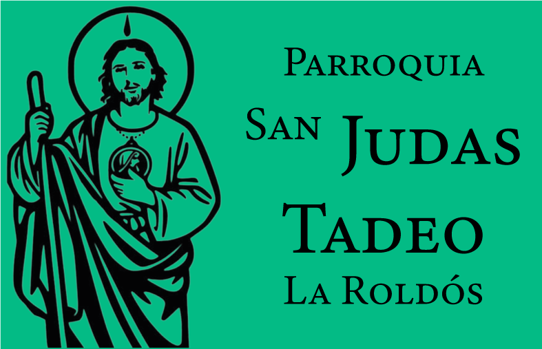
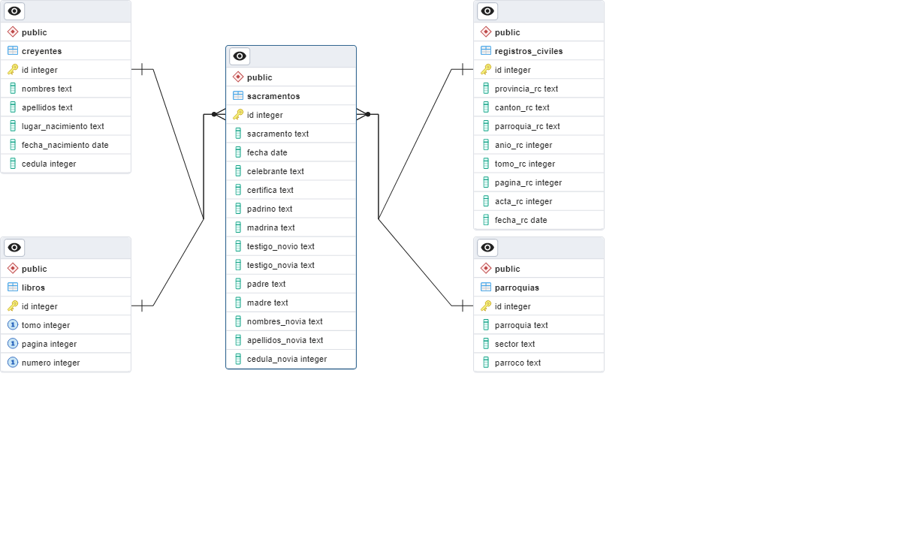

<a name="readme-top"></a>

<div align="center">
  
  <br/>

  <h3><b>Parroquia San Judas Tadeo</b></h3>

</div>

<!-- TABLE OF CONTENTS -->

# 📗 Table of Contents

- [📖 About the Project](#about-project)
  - [🛠 Built With](#built-with)
    - [Tech Stack](#tech-stack)
    - [Key Features](#key-features)
  - [🚀 Live Demo](#live-demo)
- [💻 Getting Started](#getting-started)
  - [Prerequisites](#prerequisites)
  - [Setup](#setup)
  - [Install](#install)
  - [Usage](#usage)
- [👥 Authors](#authors)
- [🤝 Contributing](#contributing)
- [⭐️ Show your support](#support)
- [🙏 Acknowledgements](#acknowledgements)
- [📝 License](#license)

<!-- PROJECT DESCRIPTION -->

# 📖 Parroquia San Judas Tadeo <a name="about-project"></a>

**Parroquia San Judas Tadeo** is a software to register people who have done any sacrament like baptism, confirmation, and marriage. It also allows to register the sacraments that have been done in the parish.

## 🛠 Built With <a name="built-with"></a>

### Tech Stack <a name="tech-stack"></a>

<details>
  <summary>Client</summary>
  <ul>
    <li><a href="https://www.ruby-lang.org/es/">Ruby</a></li>
    <li><a href="https://rubydoc.info/gems/fxruby/frames">FXRuby</a></li>
  </ul>
</details>

<details>
<summary>Database</summary>
  <ul>
    <li><a href="https://www.postgresql.org/">PostgreSQL</a></li>
  </ul>
</details>

<!-- Features -->

### Key Features <a name="key-features"></a>

- **Desktop App**
- **GUI FXRuby**
- **Ruby app**

<p align="right">(<a href="#readme-top">back to top</a>)</p>

<!-- LIVE DEMO -->

## 🚀 Live Demo <a name="live-demo"></a>

- **Home page**

  


- **Baptism registration**

  


- **Confirmation registration**

  


- **Marriage registration**

  


- **Searchings**

  

  **Searching Results**

  


- **ERD Schema**

 


<p align="right">(<a href="#readme-top">back to top</a>)</p>

<!-- GETTING STARTED -->

## 💻 Getting Started <a name="getting-started"></a>


To get a local copy up and running, follow these steps.

### Prerequisites

In order to run this project you need:

- **Ruby 3.2.2**
- **PostgreSQL 15**

### Setup

Clone this repository to your desired folder:

```sh
  cd my-folder
  git clone git@github.com:franclobo/Parroquia-San-Judas-Tadeo.git
```


### Install

Install this project with:


```sh
  bundle install
```

Also you can install the gem:

```sh
  gem install parroquia
```

### Usage

To run the project, execute the following command:

```sh
  ruby main.rb
```
Or you can run the gem:

```sh
  parroquia
```

<!-- AUTHORS -->

## 👥 Authors <a name="authors"></a>

> Mention all of the collaborators of this project.

👤 **Author1**

- GitHub: [@franclobo](https://github.com/franclobo)
- Twitter: [@Pancho2788](https://twitter.com/Pancho2788)
- LinkedIn: [Francisco Borja](https://www.linkedin.com/in/francisco-borja-lobato/)
- WEbsite: [Web Minds Studio](https://www.webmindsstudio.com)

<p align="right">(<a href="#readme-top">back to top</a>)</p>

<!-- CONTRIBUTING -->

## 🤝 Contributing <a name="contributing"></a>

Contributions, issues, and feature requests are welcome!

Feel free to check the [issues page](../../issues/).

<p align="right">(<a href="#readme-top">back to top</a>)</p>

<!-- SUPPORT -->

## ⭐️ Show your support <a name="support"></a>

If you like this project or want to see more content like this, you can give it a ⭐️

<p align="right">(<a href="#readme-top">back to top</a>)</p>

<!-- ACKNOWLEDGEMENTS -->

## 🙏 Acknowledgments <a name="acknowledgements"></a>

I would like to thank the parish who gave me the opportunity to develop this project.

<p align="right">(<a href="#readme-top">back to top</a>)</p>

<!-- LICENSE -->

## 📝 License <a name="license"></a>

This project is [MIT](./LICENSE) licensed.

<p align="right">(<a href="#readme-top">back to top</a>)</p>
